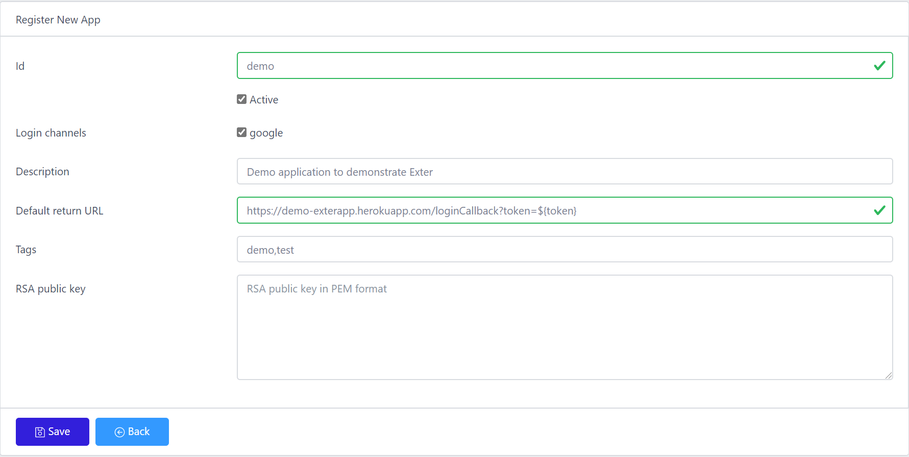
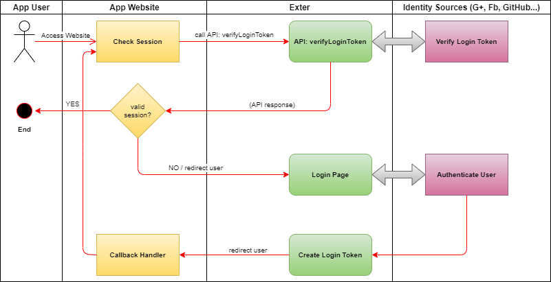

# Exter: Integration

This document provides guidelines for application developers to integrate their web applications with Exter.

> Requirement: you need a running Exter instance. You can deploy [our own Exter instance](BuildAndRun.md) or use the pre-hosted [ExterOSS](https://btnguyen2k.github.io/exter/).

## Register your app with Exter

First, you need to register your application with Exter. Simply login to Exter control panel and register your application. An example of app registration form is as the following:

> - Application id must be unique within the Exter instance.
> - `Default return URL` is the application's default callback url.
> - _`RSA public key` is currently not used_.

## Handle user login flow

To initialize authentication flow, application redirects user to Exter's login page (*). The login page offers user the list of available identity sources (e.g. Facebook, Google, Linkedin, etc). The user picks one identity source to continue the authentication process on the chosen identity source's web site.

Once the user is successfully authenticated, Exter generates a login-token and redirects the user back to application's callback url. The login-token is attached long the callback url.

Application stores the login-token (e.g. in user session) and latter calls [Exter's API](#apis) `verifyLoginToken` to check if the login-token is still valid.

The whole flow is visualized as the following diagram:

**Exter's Login page and callback url**

(*) Exter does _not_ ask for or store user credential. The credential is entered at the identity source web site (e.g. Facebook, Google, Linkedin, etc).

Exter provides 2 login pages application can choose to redirect user to:

- `<exter-base-url>/app/#/xlogin?app<app-id>&returnUrl=<callback-url>`: force user login even if there is an existing login session.
- `<exter-base-url>/app/#/xcheck?app<app-id>&returnUrl=<callback-url>`: does not force login if there is an existing login session (SSO).

Parameters:

- `app-id`: [registered application id](#register-your-app-with-exter).
- `callback-url`: (optional) the url Exter redirects user to upon successful authentication.
  - Callback url is optional. If application does not provide one, the [default return URL](#register-your-app-with-exter) will be used.
  - Any occurence of the string `${token}` in the callback url (or default return URL) will be replaced by the login-token string. For example, the callback url `https://mydomain/exterCallback?loginToken=${token}&otherParam=otherValue` becomes `https://mydomain/exterCallback?loginToken=abcd1234ef56&otherParam=otherValue` (where `abcd1234ef56` is the login-token)

**Login-token**

The login-token generated by Exter is a signed [JWT](https://jwt.io/introduction/).
Client applications can verify the login-token using [Exter's public RSA key](#apis).

## Exter's Pages and APIs

## Read more

- [Set a running Exter instance](BuildAndRun.md)
